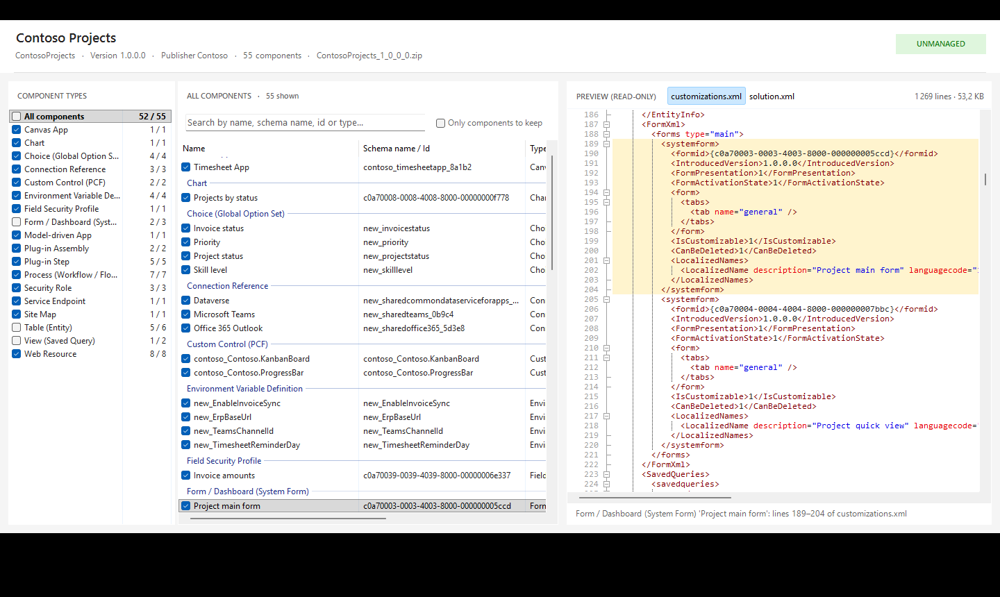
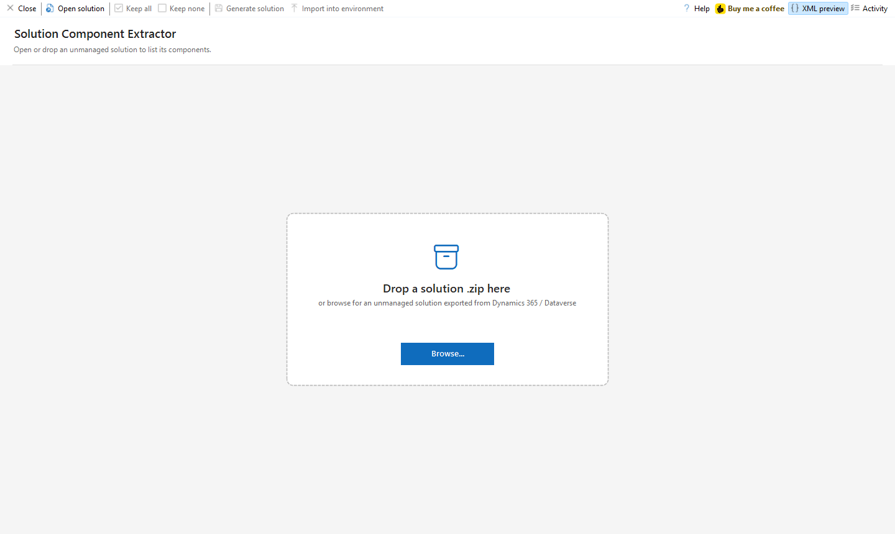
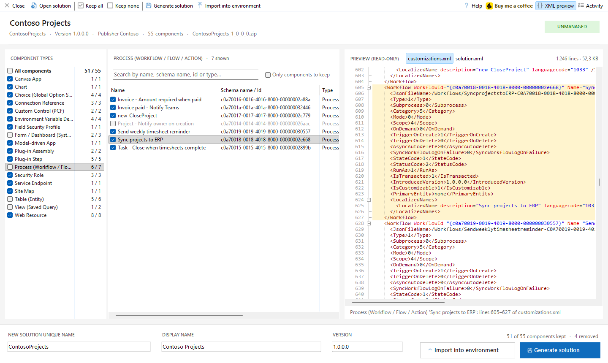
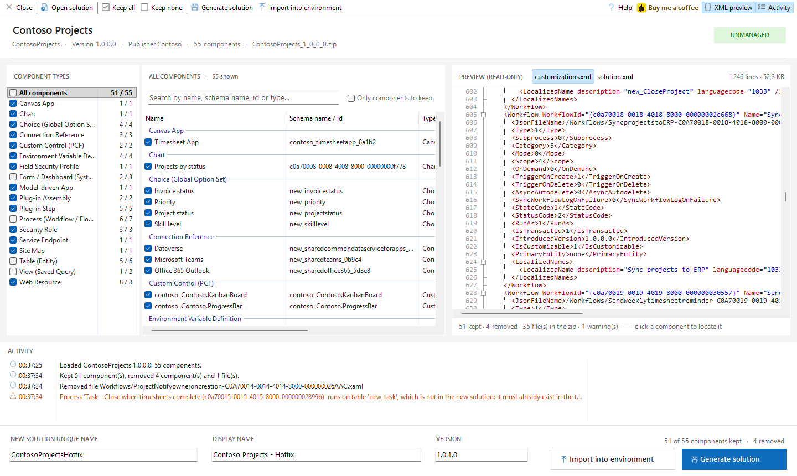
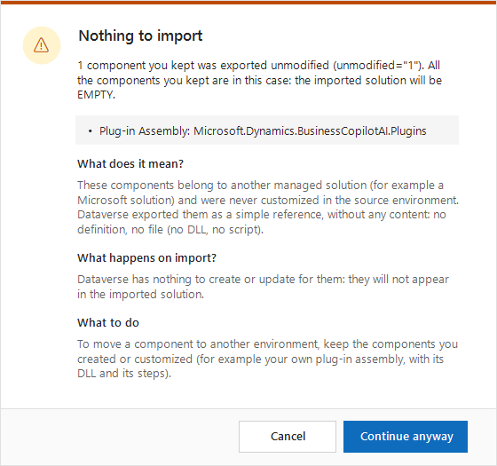
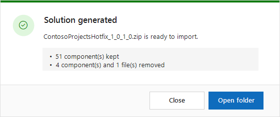
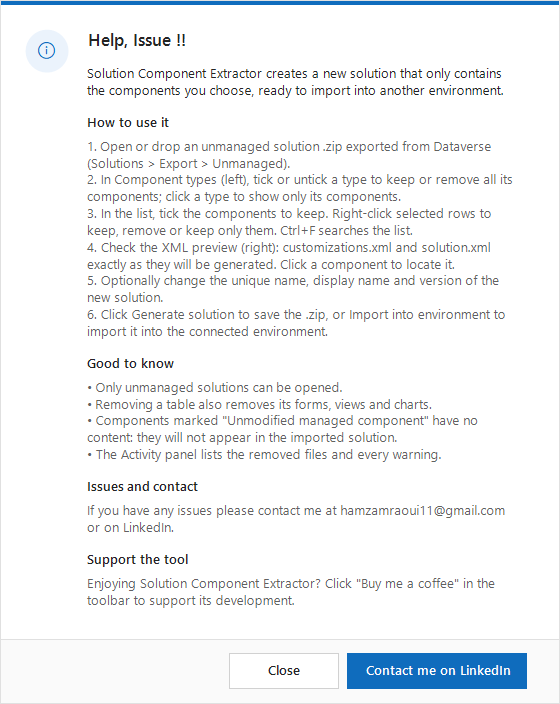

# Solution Component Extractor

**An XrmToolBox tool to build a smaller Dataverse solution from a big one: open an unmanaged solution, keep only the components you need, and get a new solution zip ready to import.**




## Why?

A solution often holds much more than what you need to deploy: dozens of tables, flows, web resources and plug-ins, when only a hotfix or a single feature has to move to another environment. Rebuilding a solution by hand in the maker portal is slow and error-prone.

Solution Component Extractor works on the exported **.zip** file: you pick the components to keep and it writes a new solution with the **same format, publisher and structure** as the original, ready to import. No connection is needed to build it.

## Features

- **Drag and drop** an unmanaged solution .zip, or browse for it.
- **Every root component listed and grouped by type**: tables, forms, views, charts, choices, security roles, processes and cloud flows, web resources, model-driven and canvas apps, site maps, PCF controls, plug-in assemblies and steps, service endpoints, environment variables, connection references…
- **Keep or remove a whole type in one click**, with a kept / total counter per type.
- **Search, sort and bulk actions**: right-click selected rows to keep, remove or keep only them.
- **Live XML preview** of `customizations.xml` and `solution.xml`, recomputed at each change. Click a component to jump to its XML block.
- **Consistent output**: definitions, files, relationships, field mappings and missing dependencies of removed components are removed too; files still used by a kept component are never deleted.
- **New unique name, display name and version** for the generated solution, validated as you type.
- **Clear warnings** before you generate: managed components exported without content, processes running on a removed table, components removed together with their table.
- **Import into the connected environment** directly from the tool, with readable error messages and the list of failed components.

## Screenshots

### Open a solution
Drop the exported .zip on the tool, or click **Browse...**. Only unmanaged solutions are accepted.



### Keep or remove by type
Click a type to list only its components, tick or untick it to keep or remove all of them. Here a classic workflow is removed and the preview shows where the cloud flow *Sync projects to ERP* sits in `customizations.xml`.



### New solution and activity
Give the new solution its own name and version. The **Activity** panel lists the removed files and every warning.



### Warnings that explain
Some components are only references to another managed solution (for example a Microsoft plug-in assembly exported with `unmodified="1"`): importing them changes nothing. The tool tells you before you generate.



### Ready to import



## Getting started

### Install

- **From XrmToolBox**: open the **Tool Library**, search for *Solution Component Extractor* and install it.
- **Manually**: copy `SolutionComponentExtractor.dll` from the [releases](https://github.com/AmraouiH/SolutionComponentExtractor/releases) to `%APPDATA%\MscrmTools\XrmToolBox\Plugins`, then restart XrmToolBox.

### Use

1. In the source environment, export the solution as **Unmanaged** (*Solutions > Export > Unmanaged*).
2. Open **Solution Component Extractor** in XrmToolBox and drop the .zip on it.
3. Tick the components to keep: by type on the left, one by one in the list.
4. Check the XML preview on the right.
5. Optionally change the unique name, display name and version.
6. Click **Generate solution** to save the new .zip, or **Import into environment** to import it into the connected environment.

The **Help** button in the toolbar shows these steps inside the tool.



## What the generated solution contains

| File | Content |
| --- | --- |
| `solution.xml` | Only the kept `RootComponent` entries. Missing dependencies declared by removed components are dropped. Unique name, display name and version are updated; the publisher is unchanged. |
| `customizations.xml` | Definitions of removed components are deleted. Relationships whose lookup lives on a removed table, and field mappings to or from a removed table, are deleted too. Emptied sections are written as `<Section />`, like Dataverse exports them. Everything else is unchanged. |
| Other files | Files used only by removed components are deleted: flow JSON, workflow XAML, web resource content, plug-in DLLs, PCF folders, `environmentvariabledefinitions/<name>/`… A file that a kept component also uses is never deleted. |

Zip entry order, `[Content_Types].xml` and XML encoding are preserved.

## Good to know

- **Unmanaged solutions only**: a managed solution is locked and cannot be split.
- **Tables are kept or removed as a whole**, with the subcomponents included in the source solution. A form, view or chart listed as its own component is removed together with its table.
- **Dependencies are not resolved for you**: if a kept component needs a removed one, that component must already exist in the target environment, otherwise the import fails. The tool warns you about the common cases.
- **Unmodified managed components** (`unmodified="1"`) have no content: they will not appear in the imported solution.

## Build from source

Requirements: Visual Studio 2022 or later with the .NET desktop workload (.NET Framework 4.8).

1. Clone the repository and open `SolutionComponentExtractor.sln`.
2. Restore the NuGet packages and build.
3. Press **F5**: the project starts the XrmToolBox copied in `bin\Debug` with `/overridepath:.`, which loads the plugin from `bin\Debug\Plugins` without touching your own XrmToolBox.

XrmToolBox caches the metadata of each tool (author, donation…) per version: increase `AssemblyVersion` in `Properties\AssemblyInfo.cs` for every release.

```
SolutionComponentExtractor/
├── Core/                     Engine, no XrmToolBox dependency
│   ├── SolutionPackage.cs        reads the zip and lists the root components
│   ├── ComponentLocator.cs       finds the XML definition of each component
│   ├── SolutionExtractor.cs      builds the new solution
│   ├── SolutionPreview.cs        XML preview and line ranges
│   └── ImportDiagnostics.cs      explains import errors
├── UI/                       Theme, dialogs, drop zone, list view
├── MyPlugin.cs               XrmToolBox plugin declaration
├── MyPluginControl.cs        Main screen
└── MyPluginControl.Preview.cs  Live XML preview
```

## Support

- Found a bug or have an idea? [Open an issue](https://github.com/AmraouiH/SolutionComponentExtractor/issues).
- Contact: [LinkedIn](https://www.linkedin.com/in/hamza-amraoui/) or hamzamraoui11@gmail.com.
- Enjoying the tool? [Buy me a coffee](https://www.paypal.me/EntityFieldsAnalyser) ☕

## License

[MIT](LICENSE.txt)
